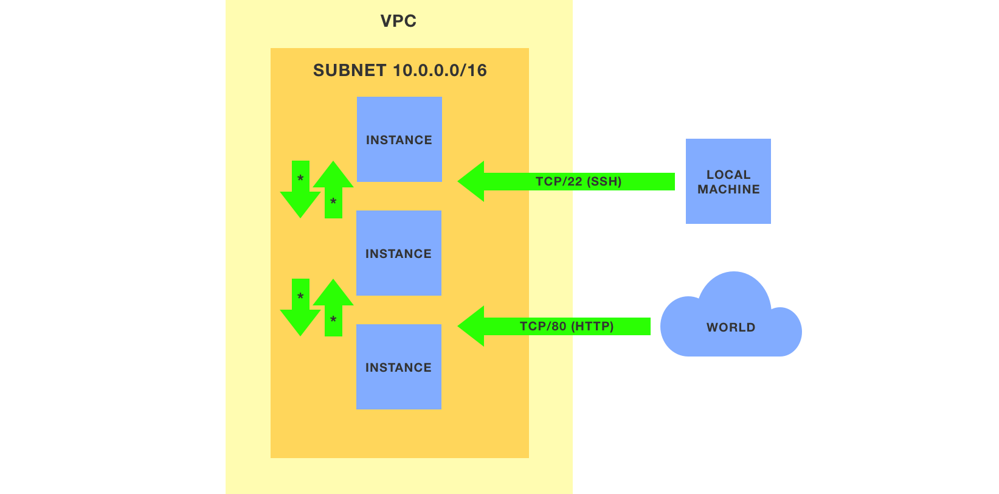

# Example cloud infrastructure — CLI

This repo shows how to create an example cloud infrastructure on the major cloud providers with the official CLI clients.

> _See also [cloud-infra-terraform](https://github.com/weibeld/cloud-infra-terraform) for creating the same cloud infrastructure with Terraform._

## Contents

- **[`aws.sh`](aws.sh):** creating AWS infrastructure with the [`aws`](https://aws.amazon.com/cli/) CLI client
- **[`gcp.sh`](gcp.sh):** creating GCP infrastructure with the [`gcloud`](https://cloud.google.com/sdk/gcloud) CLI client

## Infrastructure

The example cloud infrastructure consists of the following generic components:



- A virtual private cloud (VPC) network
- A subnet with a private IP address range of 10.0.0.0/16
- 3 compute instances running Ubuntu 18.04
- Firewall rules that allow the following types of traffic to/from the instances:
    - Incoming SSH traffic from your local machine
    - Incoming HTTP traffic from everywhere
    - All incoming traffic from other instances of the example infrastructure
    - All outgoing traffic to everywhere

All compute instances get a public IP address and you will be able to connect to them with SSH from your local machine.

_The concrete resources that are created for each cloud provider are listed below._

## Prerequisites

You have to install and configure the CLI clients of the corresponding cloud providers:

- [`aws`](https://aws.amazon.com/cli/) for AWS ([installation instructions](https://docs.aws.amazon.com/cli/latest/userguide/cli-chap-install.html))
- [`gcloud`](https://cloud.google.com/sdk/gcloud) for GCP ([installation instructions](https://cloud.google.com/sdk/gcloud#downloading_the_gcloud_command-line_tool))

The configuration must include the credentials to access your account as well as a default region.

## Amazon Web Services (AWS)


### Usage

Create the infrastructure:

```bash
./aws.sh up
```
Delete the infrastructure:

```bash
./aws.sh down
```
### Created infrastructure

The [`aws.sh`](aws.sh) script creates (and deletes) the following AWS resources:

- 1 [VPC](https://docs.aws.amazon.com/vpc/latest/userguide/what-is-amazon-vpc.html) (1 route table, 1 security group, 1 [network ACL](https://docs.aws.amazon.com/vpc/latest/userguide/vpc-network-acls.html))
- 1 [internet gateway](https://docs.aws.amazon.com/vpc/latest/userguide/VPC_Internet_Gateway.html)
- 1 [subnet](https://docs.aws.amazon.com/vpc/latest/userguide/VPC_Subnets.html)
- 1 [route table](https://docs.aws.amazon.com/vpc/latest/userguide/VPC_Route_Tables.html)
- 2 [security groups](https://docs.aws.amazon.com/vpc/latest/userguide/VPC_SecurityGroups.html)
- 1 [key pair](https://docs.aws.amazon.com/AWSEC2/latest/UserGuide/ec2-key-pairs.html)
- 3 [EC2 instances](https://docs.aws.amazon.com/AWSEC2/latest/UserGuide/concepts.html) (3 [EBS volumes](https://docs.aws.amazon.com/AWSEC2/latest/UserGuide/AmazonEBS.html), 3 [network interfaces](https://docs.aws.amazon.com/AWSEC2/latest/UserGuide/using-eni.html))

### Accessing the infrastructure

After all resources have been created, you can list the IDs and public IP addresses of the instances with:

```bash
aws ec2 describe-instances \
  --filters "Name=tag:project,Values=aws-example-infra" \
  --query 'Reservations[*].Instances[*].[InstanceId,PublicIpAddress]' \
  --output text
```

The `aws.sh up` command creates a private key file named `example-infra-cli.pem` in your current working directory. You can use this private key to connect to any of the instances with SSH as follows:

```bash
ssh -i example-infra-cli.pem ubuntu@<PUBLIC_IP>
```

Where `<PUBLIC_IP>` is the public IP address of the instance.

## Google Cloud Platform (GCP)


### Usage

Create the infrastructure:

```bash
./gcp.sh up
```
Delete the infrastructure:

```bash
./gcp.sh down
```

### Created infrastructure

The [`gcp.sh`](gcp.sh) script creates (and deletes) the following GCP resources:

- 1 [VPC network](https://cloud.google.com/vpc/docs/vpc)
- 1 [subnet](https://cloud.google.com/vpc/docs/vpc#vpc_networks_and_subnets)
- 3 [firewall rules](https://cloud.google.com/vpc/docs/firewalls)
- 3 [VM instances](https://cloud.google.com/compute/docs/instances)

### Accessing the infrastructure

After all resources have been created, you can list the created instances with:

```bash
gcloud compute instances list --filter 'tags.items=example-infra-cli'
```

The above command displays, among others, the name and public IP address of each instance.

You can connect to any of the instances with:

```bash
gcloud compute ssh <NAME>
```

Where `<NAME>` is the name of the instance.

You can also connect as root with:

```bash
gcloud compute ssh root@<NAME>
```

And you can also use the native SSH client with:

```bash
ssh -i ~/.ssh/google_compute_engine <PUBLIC-IP>
```

Where `<PUBLIC-IP>` is the public IP address of the instance.
